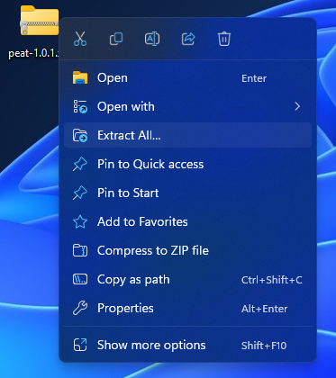
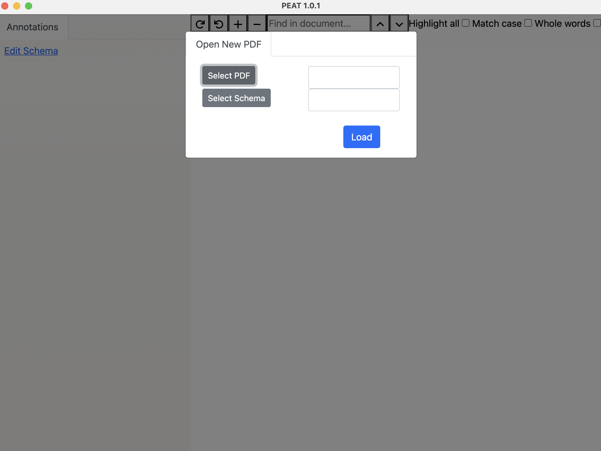
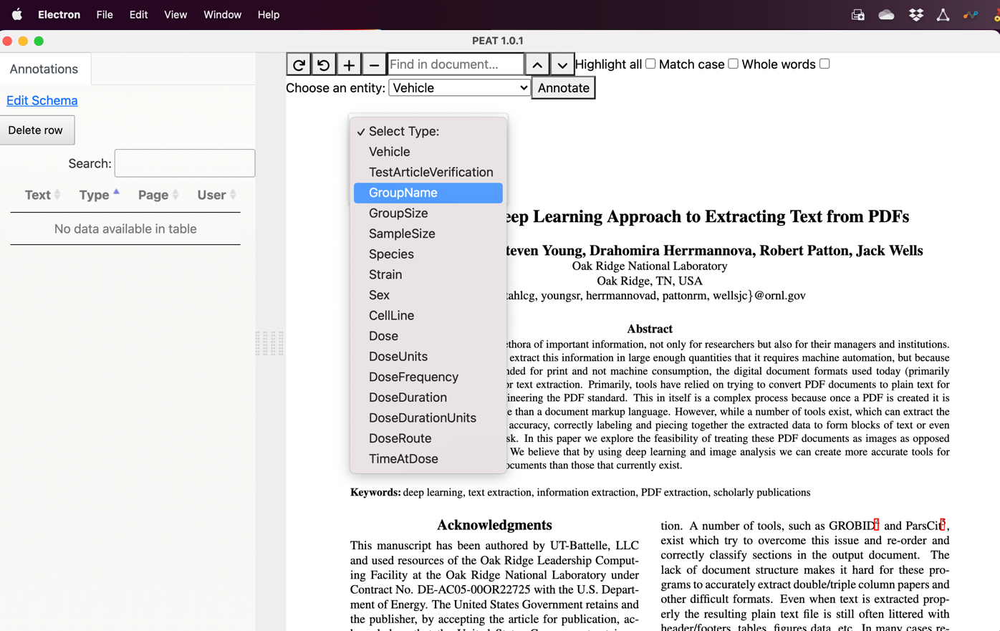

# PEAT

PEAT (PDF Entity Annotation Tool) is a portable, standalone application built off the Electron software framework and can be used on all major operating systems (Windows, Linux, and Macintosh) and provides an interface for users to annotate PDFs.

PEAT was designed to take advantage of the latest advancements in PDF text extraction methods while also allowing the user to annotate and label the data directly in PDF format. This approach allows a user to work in a document structure they are familiar with, improving the user experience and facilitating the creation of labeled data for machine consumption and training of future machine learning models.

The application allows users to load PDFs directly from their file system along with data annotation forms with standard or customizable annotation types, labels, entities, and other features such as custom color highlighting. The application also includes features for users to edit and import/export data extraction schemas, export annotations of X and Y PDF coordinal structure (based on the image layer of the PDF), search and manipulate annotations, and save/load progress. Once a user has completed document annotation, the labeled data, full text, and all associated metadata is exportable in JSON format that can be processed by a variety of NLP model building applications such as Spacy or PyTorch.

# Installation

<details>
<summary>Windows</summary>

A compiled Windows binary is created and added to every release in GitHub.

1. Download latest release from https://github.com/USEPA/peat/releases/. It should be zip file named `peat-windows.zip`
1. Unzip the zip file.

    ---

    

    ---
1. Double click the PEAT installer to install the application
1. After installation, a `PEAT` shortcut should be added to your desktop and Start Menu.
1. Select the PDF and Schema (example files are available; [tags.json](https://github.com/USEPA/peat/blob/main/public/tags.json) and [test.pdf](https://github.com/USEPA/peat/blob/main/public/test.pdf)) and click _Load_



---

The application is installed in `%USERPROFILE%\AppData\Local\Programs\peat`.

An uninstaller is also available in this location.

You can also follow the instructions below to build the application from source.

</details>

<details>
<summary>Linux/Mac</summary>

1.  Clone the repo `git clone https://github.com/USEPA/peat.git`

2.  Install the following prerequisites:
    * NodeJS: https://nodejs.org/
    * Yarn: https://yarnpkg.com/

3. In the PEAT directory run yarn to download the dependencies:

    `yarn`

4. Run the application:

    `yarn start`

5. To build a standalone application for you system run:

    `yarn package`

This will create a release folder providing multiple application versions.

</details>
</br>

# Application Usage

<details>
<summary>Load PDF</summary>

1.  Click _File_ in the menu bar and select _Load PDF_.

---


---

2.  Select the PDF file from your computer and click _Open_.

---


---

---


---

---

</details>

<details>
<summary>Annotate PDF</summary>

1.  Highlight text you wish to annotate and select _Add Annotation_.

---


---

---

2.  Select the annotation type.

---



---

---

3.  Hit save

---


---

---

---


---

---

</details>

<details>
<summary>Save Annotations</summary>

1.  Click _File_ in the menu bar and select _Save Annotations_.

---


---

---

2.  Select a save location on your computer and click _Save Annot File_.

---


---

---

</details>

<details>
<summary>Load Annotations</summary>
1.  Click *File* in the menu bar and select *Load Annotations*.

---


---

---

2.  Select an annotation file and click _Open_

---


---

---

---


---

---

</details>

<details>
<summary>Delete Annotations</summary>

1\. Select annotation you wish to delete from the table in the side bar.

---


---

---

2\. Click _Delete selected row_ button.

---


---

---

</details>

<details>
<summary>Edit Schema</summary>

1\. Click *Edit Schema* hyper-link

---


---

---

- Change existing entity

  - Click the text of any entity to edit that entities type.

  - Click the color selector to change the annotation color.

  - Click the trash can icon to delete that entity.

- Add new entity type

  - Click Add Entity Type to add a new entity.

- Save changes

  - Click the Save button.

</details>

<details>
<summary>Auto Annotation</summary>

1\. Type word or phrase to be searched for in *Find in document* search
bar

---


---

---

2\. Using the arrows (Up or Down) a yellow highlight will cycle through
matches found in the document.

3\. Select entity type from the dropdown box.

---


---

---

4\. Click Annotate to add an annotation for the current selection.

---


---

---

</details>
</br>

# Annotation Output
<details>
<summary>Example JSON</summary>

This is an annotated sample of exported annotation data.

```json5
{
    "text": "This is the text of the document",  // Text version of the PDF file, contains full text of the document as a string.
    "relationships": [], // Not yet implimented, experimental feature for creating relational contructs between annotations.
    "schema": { // Schema used to annotate the document
        "annotation_types": [
            {
                "id": "foo", // Unique ID
                "name": "foo", // Text name
                "color": "#ce11dd"  // HTML display color
            }
        ],
        "relationship_types": [] // Not yet implimented
    },
    "highlights": [
        {
            "content": {
                "text": "text of the annotation"  // Text of the annotation highlight as a string.
            },
            "position": {  // Bounding box position of the highlight within the PDF coordinates.
                "boundingRect": {
                    "x1": 66.8515625,
                    "y1": 250.1328125,
                    "x2": 205.14230346679688,
                    "y2": 263.1328125,
                    "width": 763,
                    "height": 1079.0995605399849
                },
                "rects": [ // Can have multiple rects if text spans lines
                    {
                        "x1": 66.8515625,
                        "y1": 250.1328125,
                        "x2": 205.14230346679688,
                        "y2": 263.1328125,
                        "width": 763,
                        "height": 1079.0995605399849,
                        "background": "#70f07b" // Highlight color
                    }
                ],
                "pageNumber": 1
            },
            "comment": {
                "text": "foo",  // Annotation ID
                "relationship": "",
                "begin": 267,  // Offset coordinates within the document text.
                "end": 298
            },
            "userName": "your_username",
            "timestamp": 1710438139123,
            "id": "34752752411373633" // highlight ID
        }
    ]
}
```
</details>
</br>

# Contributing

There are many ways you can contribute to PEAT, such as:

- Reporting bugs or suggesting enhancements
- Improving the documentation or the user interface
- Adding new features or functionalities
- Writing tests or fixing issues
- Reviewing or commenting on pull requests or issues

To get started, you will need to fork the PEAT repository and clone it to your local machine. You will also need to install Node.js and Yarn to run and build the application. Please follow the instructions in the README file for more details.

If you encounter a bug or have a suggestion for an enhancement, please open an issue on git. Please provide as much information as possible to help us reproduce and resolve the issue. Please also check if there are any existing issues or pull requests that are similar to yours before opening a new one.

# Disclaimer

The United States Environmental Protection Agency (EPA) GitHub project code and binary files are provided on an "as is" basis and the user assumes responsibility for its use.  EPA has relinquished control of the information and no longer has responsibility to protect the integrity, confidentiality, or availability of the information.  Any reference to specific commercial products, processes, or services by service mark, trademark, manufacturer, or otherwise, does not constitute or imply their endorsement, recommendation or favoring by EPA.  The EPA seal and logo shall not be used in any manner to imply endorsement of any commercial product or activity by EPA or the United States Government.
