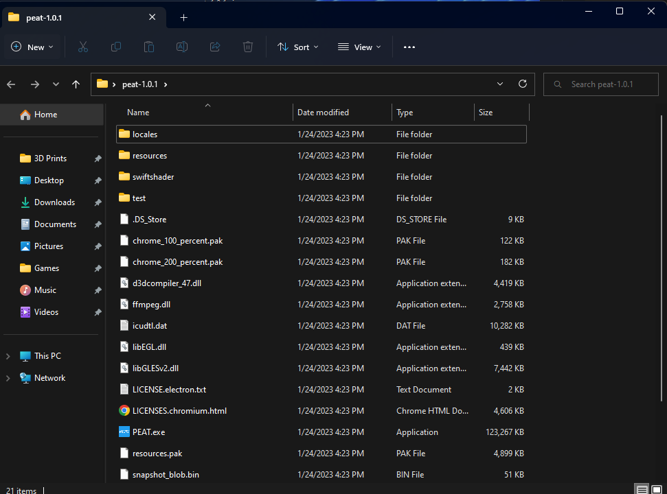
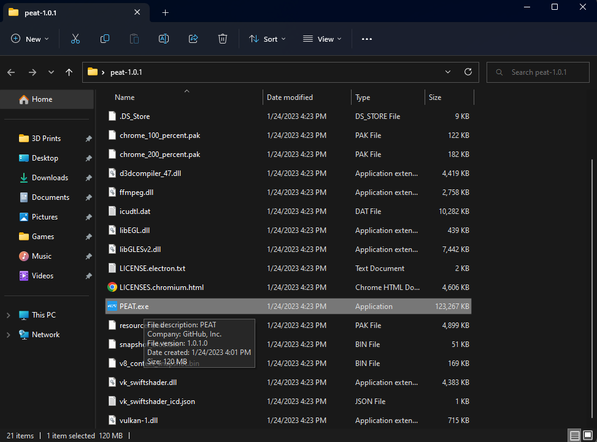

# NodeJS and Yarn Requirement
NodeJS: https://nodejs.org/
Yarn: https://yarnpkg.com/

# Download devDependencies
`yarn`

# Run
`yarn start`

# Package
`yarn package`

# Statement of Need

PEAT is a portable, standalone application built off the Electron software framework and can be used on all major operating systems (Windows, Linux, and Macintosh) and provides an interface for users to annotate PDFs.  

PEAT was designed to take advantage of the latest advancements in PDF text extraction methods while also allowing the user to annotate and label the data directly in PDF format. This approach allows a user to work in a document structure they are familiar with, improving the user experience and facilitating the creation of labeled data for machine consumption and training of future machine learning models.

The application allows users to load PDFs directly from their file system along with data annotation forms with standard or customizable annotation types, labels, entities, and other features such as custom color highlighting. The application also includes features for users to edit and import/export data extraction schemas, export annotations of X and Y PDF coordinal structure (based on the image layer of the PDF), search and manipulate annotations, and save/load progress. Once a user has completed document annotation, the labeled data, full text, and all associated metadata is exportable in JSON format that can be processed by a variety of NLP model building applications such as Spacy or PyTorch.

# User Guide

January 2023

Version 1.0.1

# Document Revision

  ---------------------------------------------------------------------
  Date                    Version Number          Document Changes

  01/05/2021              0.1.0                   Initial draft

  07/20/2021              0.1.1                   Updated to beta PEAT
                                                  0.1.1

  09/29/2021              0.1.2                   Update to beta PEAT
                                                  0.1.2

  05/10/2022              0.1.3                   Update to beta PEAT
                                                  0.1.3

  01/24/2023              1.0.1                   Updated to release PEAT
                                                  1.0.1
  ---------------------------------------------------------------------

# 1 Installation
## 1.1 Installation Windows

1\. Download latest version from (PEAT_1.1.0)

[https://github.com/USEPA/peat/releases/download/v1.0.1-win/peat-1.0.1.zip](https://github.com/USEPA/peat/releases/download/v1.0.1-win/peat-1.0.1.zip)

2\. Right click PANDHA_1.0.0.zip' and select 'Extract All'

  -----------------------------------------------------------------------
  

  -----------------------------------------------------------------------

3\. Select location and hit *Extract*

  -----------------------------------------------------------------------
  

  -----------------------------------------------------------------------

4\. From the extracted location double click the *PANDHA_1.1.0*Folder

  -----------------------------------------------------------------------
  

  -----------------------------------------------------------------------

5\. Double click *PEAT.exe* to start the application

  -----------------------------------------------------------------------
  

  -----------------------------------------------------------------------

7\. Select the PDF and Schema (tags.json is including in the PEAT/test
folder) and click *Load*

  -----------------------------------------------------------------------
  
  -----------------------------------------------------------------------

  -----------------------------------------------------------------------

# 2 Application

## 2.0 Load PDF

1.  Click *File* in the menu bar and select *Load PDF*.

  -----------------------------------------------------------------------
  

  -----------------------------------------------------------------------

2.  Select the PDF file from your computer and click *Open*.

  -----------------------------------------------------------------------
  

  -----------------------------------------------------------------------

  -----------------------------------------------------------------------
  
  -----------------------------------------------------------------------

  -----------------------------------------------------------------------

## 2.1 Annotate PDF

1.  Highlight text you wish to annotate and select *Add Annotation*.

  -----------------------------------------------------------------------
  
  -----------------------------------------------------------------------

  -----------------------------------------------------------------------

2.  Select the annotation type.

  -----------------------------------------------------------------------
  
  -----------------------------------------------------------------------

  -----------------------------------------------------------------------

3.  Hit save

  -----------------------------------------------------------------------
  
  -----------------------------------------------------------------------

  -----------------------------------------------------------------------

  -----------------------------------------------------------------------
  
  -----------------------------------------------------------------------

  -----------------------------------------------------------------------

## 2.4 Save Annotations

1.  Click *File* in the menu bar and select *Save Annotations*.

  -----------------------------------------------------------------------
  
  -----------------------------------------------------------------------

  -----------------------------------------------------------------------

2.  Select a save location on your computer and click *Save Annot File*.

  -----------------------------------------------------------------------
  
  -----------------------------------------------------------------------

  -----------------------------------------------------------------------

## 2.5 Load Annotations

1.  Click *File* in the menu bar and select *Load Annotations*.

  -----------------------------------------------------------------------
  
  -----------------------------------------------------------------------

  -----------------------------------------------------------------------

2.  Select an annotation file and click *Open*

  -----------------------------------------------------------------------
  
  -----------------------------------------------------------------------

  -----------------------------------------------------------------------

  -----------------------------------------------------------------------
  
  -----------------------------------------------------------------------

  -----------------------------------------------------------------------

## 2.6 Delete Annotations

1\. Select annotation you wish to delete from the table in the side bar.

  -----------------------------------------------------------------------
  
  -----------------------------------------------------------------------

  -----------------------------------------------------------------------

2\. Click *Delete selected row* button.

  -----------------------------------------------------------------------
  
  -----------------------------------------------------------------------

  -----------------------------------------------------------------------

## 2.6 Edit Schema

1\. Click *Edit Schema* hyper-link

  -----------------------------------------------------------------------
  
  -----------------------------------------------------------------------

  -----------------------------------------------------------------------

-   Change existing entity

    -   Click the text of any entity to edit that entities type.

    -   Click the color selector to change the annotation color.

    -   Click the trash can icon to delete that entity.

-   Add new entity type

    -   Click Add Entity Type to add a new entity.

-   Save changes

    -   Click the Save button.

## 2.7 Auto Annotation

1\. Type word or phrase to be searched for in *Find in document* search
bar

  -----------------------------------------------------------------------
  
  -----------------------------------------------------------------------

  -----------------------------------------------------------------------

2\. Using the arrows (Up or Down) a yellow highlight will cycle through
matches found in the document.

3\. Select entity type from the dropdown box.

  -----------------------------------------------------------------------
  
  -----------------------------------------------------------------------

  -----------------------------------------------------------------------

4\. Click Annotate to add an annotation for the current selection.

  -----------------------------------------------------------------------
  
  -----------------------------------------------------------------------

  -----------------------------------------------------------------------
